# Prueba Tecnica Odoo
## Problema #1
1. Se requiere un módulo personalizado en Odoo que
contenga:
- Tarea programada que consulte el API
https://pokeapi.co/api/v2/pokemon/ y almacene en
- el módulo personalizado “Pokémon” la información.
- Crear un View que liste y permita el mantenimiento
de la información almacenada en el modelo
Pokémon.

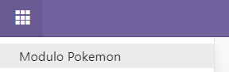

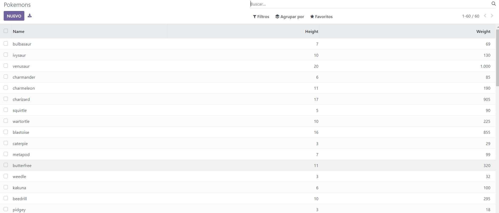

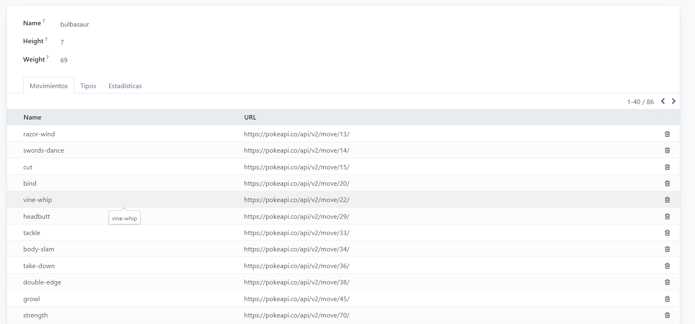

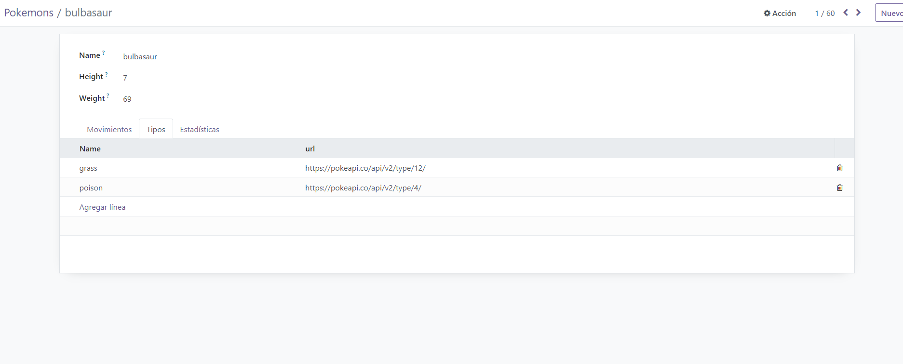

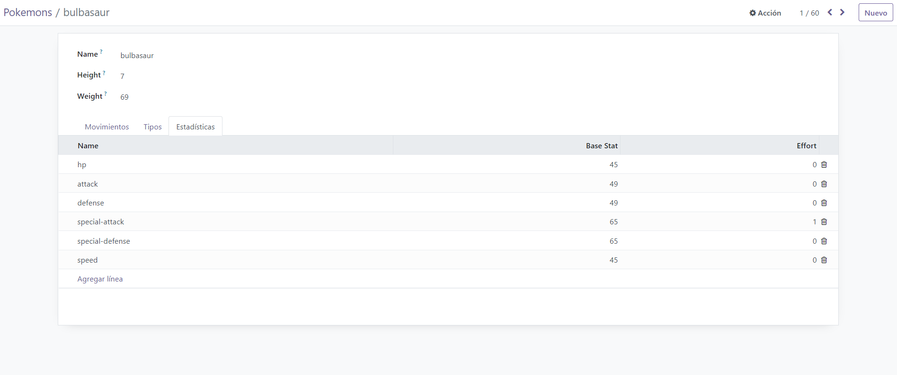

2.Se requiere un módulo personalizado en Odoo que contenga un
servicio REST API usando Web Controllers y los modelos nativos:

Partner, Order, Order Line y Product.

- Listado de Facturas (GET /invoices/)
- Crear Factura (POST /invoices/)
- Eliminar Factura (DELETE /invoices/)

El JSON que deben recibir y retornar los endpoints es el siguiente:

```

  {
    "id": ,
    "createtime": "",
    "document_number": "",
    "date": "",
    "customer": {
      "document_type": "",
      "document_number": "",
      "first_name": "",
      "last_name": "",
      "phone": ,
      "address": ,
      "email": ""
    },
    "items": [
      {
        "reference": "",
        "name": "",
        "price_unit": ,
        "price": ,
        "discount": ,
        "subtotal": ,
        "tax": ,
        "total": 
      }
    ],
  }
```

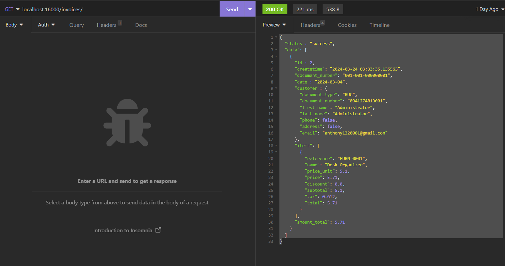

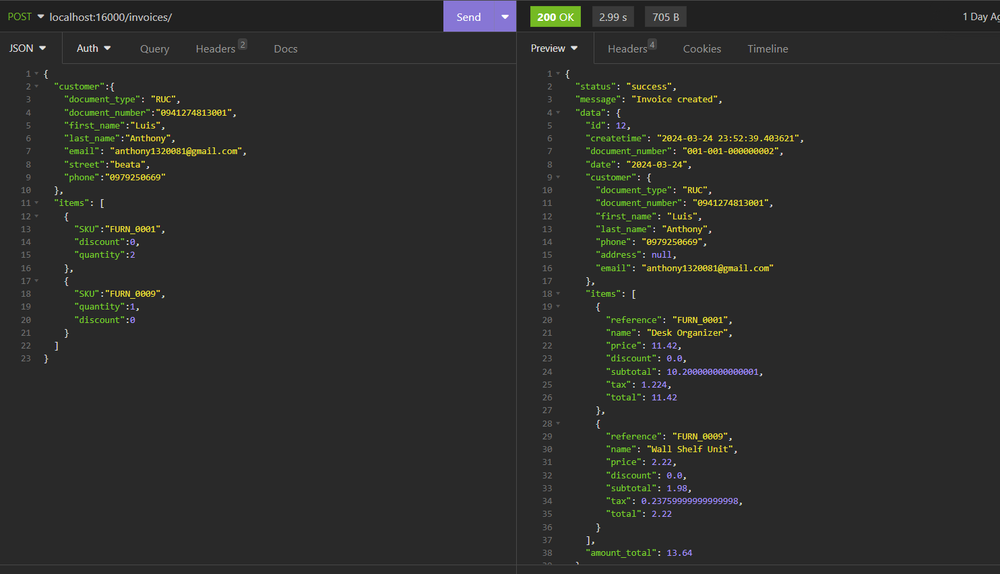

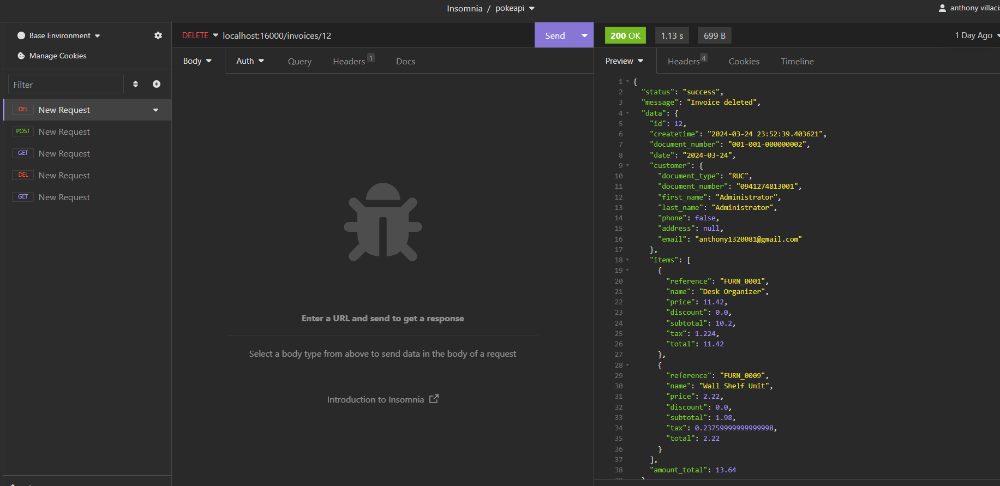

3. Se requiere un módulo personalizado en Odoo que permita en el
Punto de Venta crear un pedido por unidad o por el empaquetado
configurado en el producto.

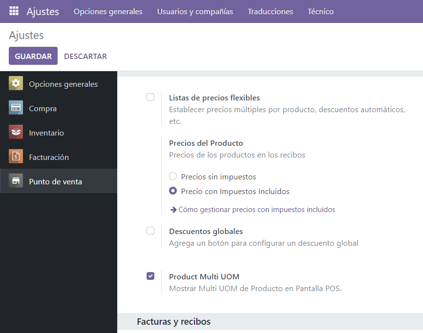

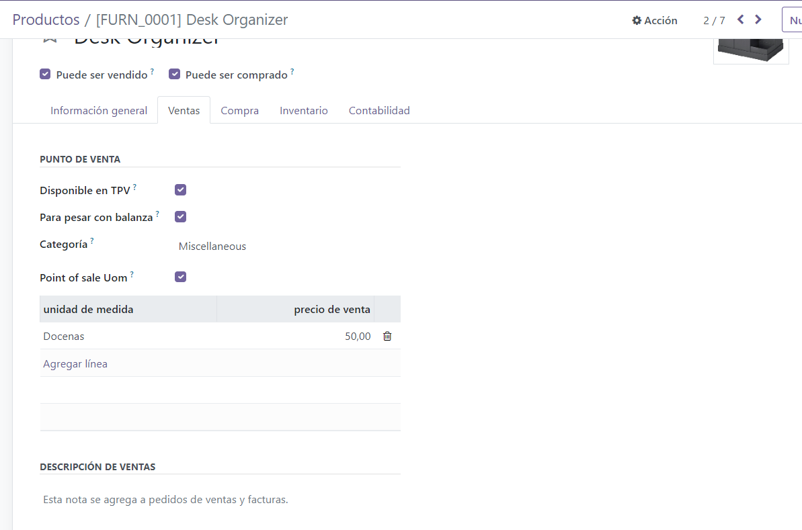

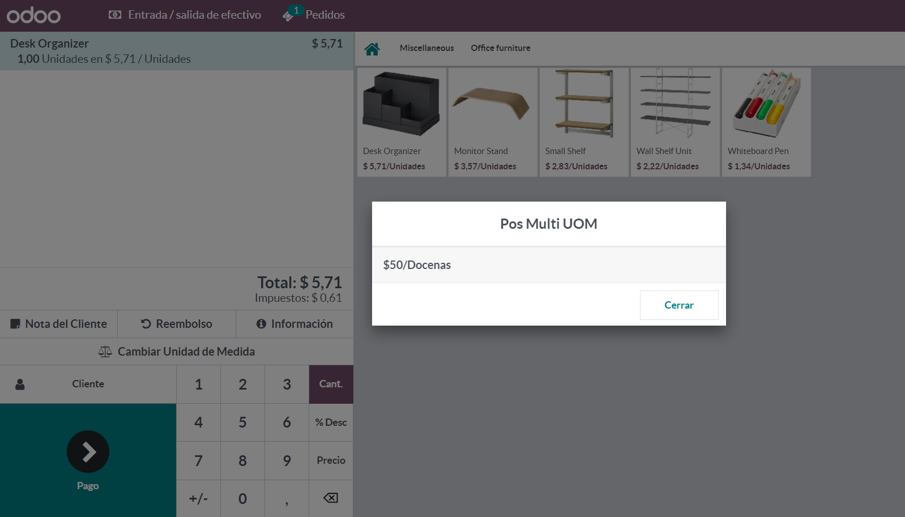

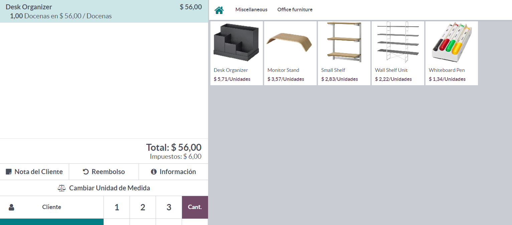